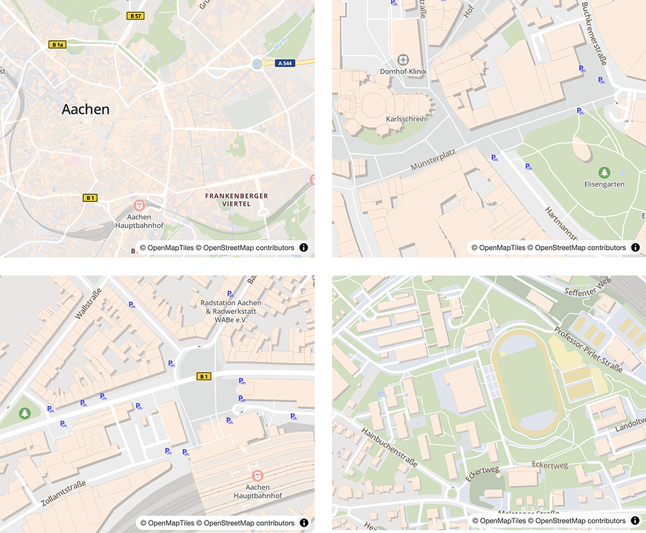

# Esel Map Style

A custom OpenMapTiles-based map style developed for [esel.ac](https://esel.ac), a free bike-sharing system. This style is designed for clarity, speed, and a bike-first mobile experience.



## Features

- **Optimized for mobile**  
  No 3D rendering, prioritizes performance and legibility on mobile devices.

- **Bicycle infrastructure**  
  Visualizes public bicycle parking and stands directly on the map.

- **Minimal, relevant POIs only**  
  Renders only essential points of interest that assist with user orientation. Excludes restaurants, bars, and unrelated commercial entities.

- **Custom icons**  
  Most POIs feature customized icons with thematic colors, for a clear and consistent visual language.

- **High-zoom house numbers**  
  Displays house numbers at high zoom levels to aid in locating bicycles, especially in the context of theft recovery or positional communication.

- **Germany-focused visual language**  
  Includes custom icons for Bundesstraßen and Autobahnen, tailored to the German road system.

## Built With

- Based on the [OpenMapTiles](https://openmaptiles.org) vector tile schema  
- Style derived from the [osm-bright-gl-style](https://github.com/openmaptiles/osm-bright-gl-style)
- Some Icons from [Material Design Icons](https://materialdesignicons.com/)

## Usage

```bash
git clone https://github.com/Empty2k12/eselac-gl-style.git
```
